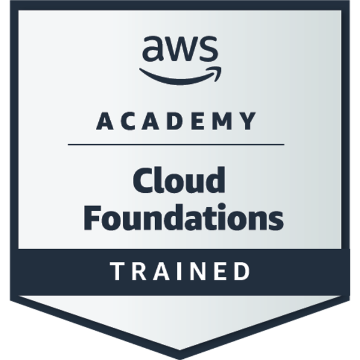

# 👋 Hi there, I’m @cyprich

🎓 Studying Applied Network Engineering at University of Žilina  
📜 Bachelor's degree in Information and Network Technologies  
⭐ Passionate about Programming, 3D Printing, Homelabbing and Electronics  
🐧 Daily Linux user with EndeavourOS on laptop and NixOS on home server  
🌱 Started coding in February 2020  
🌍 Living in Prievidza, Slovakia

## 🛠️ Tech & Tools I use

- **Languages**: Rust · Python · C++ · C# · Java · Bash
- **Web**: React · TypeScript · TailwindCSS · Actix-web · Flask
- **Databases**: PostgreSQL · SQLite · InfluxDB · sqlx · psycopg2
- **Embedded**/**IoT**: ESP32 · Arduino · Raspberry Pi · Rust no_std · MicroPython
- **Other tools**: Git · GitHub · Docker · Docker Compose · Markdown

## 📜 Courses & Certifications

- Cisco CCNA 1 - Introduction to Networks
- Cisco CCNA 2 - Switching, Routing and Wireless Essentials
- Cisco CCNA 3 - Enterprise Networking, Security and Automation
- Cisco DevNet Associate
- AWS Academy Cloud Foundations
- NDG Linux Essentials
- Certified Entry-Level Python Programmer 1 & 2 (PCEP)

    
    
    
    
    

## 📫 Contact

- **Instagram**: [@peter.tar.gz](https://www.instagram.com/peter.tar.gz/)
- **E-Mail**: [cypooriginal@gmail.com](mailto:cypooriginal@gmail.com)

---

📖 _"Code, break, learn, repeat"_
